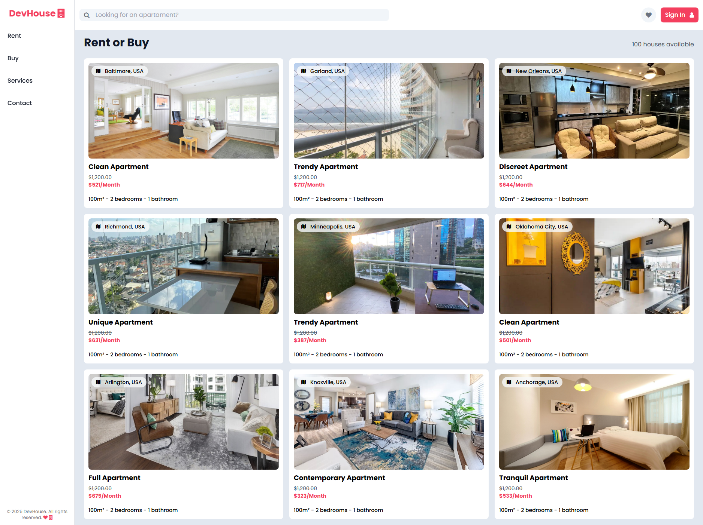
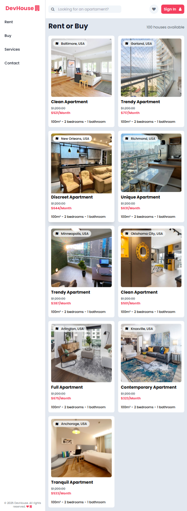
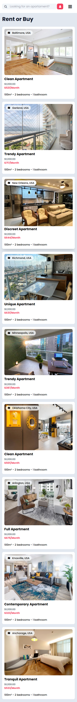

# DevHouse 🏠

A modern, responsive real estate website built with HTML, TypeScript, and Tailwind CSS. DevHouse provides an elegant interface for browsing rental and purchase properties with a clean, professional design.

## 🚀 Features

- **Responsive Design**: Fully optimized for desktop, tablet, and mobile devices
- **Dynamic Content**: Property listings with randomly generated names and locations
- **Modern UI**: Clean interface with hover effects and smooth transitions
- **Mobile-First**: Collapsible navigation menu for mobile devices
- **Real Estate Focus**: Property cards with pricing, specifications, and images
- **Fast Loading**: Optimized with Tailwind CSS for minimal bundle size

## 🛠️ Technologies Used

- **HTML5**: Semantic markup structure
- **TypeScript**: Type-safe JavaScript for better development experience
- **Tailwind CSS**: Utility-first CSS framework for rapid UI development
- **Font Awesome**: Icon library for enhanced UI elements
- **Google Fonts**: Poppins and Sora font families for modern typography

## 📁 Project Structure

```
DevHouse/
├── index.html              # Main HTML file
├── script.js               # Compiled JavaScript
├── script.ts               # TypeScript source file
├── package.json            # Project dependencies
├── tailwind.config.js      # Tailwind CSS configuration
├── tsconfig.json           # TypeScript configuration
├── assets/                 # Image assets
│   ├── 1.jpg - 9.jpg      # Property images
│   └── favicon.ico        # Site favicon
├── seeds/                  # Data files
│   ├── aptNames.js/ts     # Apartment name generators
│   └── cities.js/ts       # City name data
└── styles/
    ├── style.css          # Input CSS file
    └── output.css         # Compiled Tailwind CSS
```

## 🚀 Getting Started

### Prerequisites

- Node.js (v14 or higher)
- npm or yarn package manager

### Installation

1. Clone the repository:

```bash
git clone https://github.com/IgorJFS/DevHouse.git
cd DevHouse
```

2. Install dependencies:

```bash
npm install
```

3. Start the development server:

```bash
npm run dev
```

4. Open `index.html` in your browser or use a local server

### Build for Production

```bash
npm run build
```

This will generate a minified version of the CSS in `styles/output.css`.

## 📱 Responsive Design

The website is fully responsive and provides optimal viewing experience across different devices:

## Desktop View



## Tablet View



## Phone View



## 🎨 Design Features

- **Typography**: Modern font combinations (Poppins & Sora)
- **Layout**: Grid-based property listings with card design
- **Interactions**: Hover effects and smooth transitions
- **Navigation**: Responsive sidebar for desktop, collapsible menu for mobile

## 🏗️ Key Components

### Header

- Search functionality for property lookup
- User authentication button
- Mobile menu toggle
- Responsive navigation

### Property Cards

- High-quality property images
- Dynamic pricing display
- Location and property details
- Hover effects with image scaling

### Sidebar Navigation

- Fixed navigation for desktop
- Clean, minimal design
- Brand identity with logo

### Mobile Menu

- Slide-out navigation for mobile devices
- Touch-friendly interface
- Consistent styling with desktop version

## 🔧 Customization

### Tailwind Configuration

Modify `tailwind.config.js` to customize:

- Color palette
- Font families
- Spacing values
- Breakpoints

### Styling

- Input styles: `styles/style.css`
- Compiled output: `styles/output.css`

## 📄 License

This project is licensed under the ISC License.
